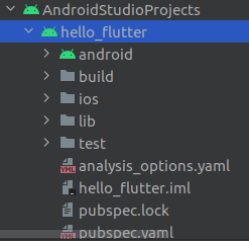

**Universidade Lusófona de Humanidades e Tecnologias**

# Sistemas Móveis Empresariais - Laboratório 1

## Introdução

Neste laboratório vamos dar início ao estudo de uma tecnologia Híbrida-Nativa chamada Flutter que é *open-source* e desenvolvidas pela Google. O Flutter permite desenvolver aplicações multiplataforma (Android e iOS) com o mesmo código fonte. Desta forma o custo da solução é mais baixo, pois reduzimos o custo do deenvolvimento em cerca de metade, sem referir que uma vez que apenas temos um código para manter invés de dois.

## O que é o Flutter

As aplicações em Flutter usam por base uma linguagem orientada a objetos também desenvolvida pela Google chamada Dart. Antes de se avançar para o desenvolvimento de uma aplicação móvel, vamos primeiramente fazer uma pequena introdução à linguagem Dart. Para isso vamos utilizar um editor de código online de [Dart](https://dartpad.dev).

## Princípios básicos do Dart

À semelhança do que acontece em outra linguagens de progamação mobile, como o Kotlin em que o seu output é Java, o output do Dart resulta em JavaScript. Desta forma, a interoperabilidade com outras plataformas está garantida. No que diz respeito aos tipos de dados, o Dart é uma linguagem bastante simplista. Tal como podemos observar na tabela abaixo, apenas possui quatro tipos de dados primitivos.

|  String |  bool |  int |  double | 
|:--:|:--:|:--:|:--:|

Vamos agora abrir o editor de código online e substituir todo o seu conteúdo pelo que consta no quadro abaixo executando-o.

~~~
void main() {
    print("Olá Sistema móveis empresariais"); // Imprime na consola Olá Sistema móveis empresariais
}
~~~

Vamos declarar na linha anterior ao **print** uma variável do tipo **String** onde iremos guardar o ano letivo da unidade curricular. O objetivo será imprimir a mensagem "Olá Sistemas móveis empresariais 2022/2023" com recurso a essa mesma variável.

~~~
void main() {
    String anoLetivo = "2022/2023";
    print("Olá Sistema móveis empresariais $anoLetivo");
}
~~~

Tal como outras linguagens de tipagem dinâmica, o Dart permite a não especificação do tipo de variável a ser declarada.

~~~
void main() {
    var anoLetivo = "2022/2023"; // Variável mutável
    print("Olá Sistema móveis empresariais $anoLetivo");
}
~~~

Como ilustrado abaixo, as constantes são declaradas com o modificador **final**, tal como em Java.

~~~
final String constante = "ola"; // Variável imutável ou constante
constante = "adeus"; // Erro, fazer uma reafetação
~~~

O Dart também permite realizar operações aritméticas diretamente num **print**. Para isso, temos de envolver essa operação **dentro de duas chavetas** imediatamente a seguir ao caractere **$**.

~~~
void main() {
    print("5 + 10 = ${5 + 10}");
}
~~~

Para finalizarmos esta parte, vamos abordar as listas. Em Dart, as listas são declaradas e inicializadas com parêntesis retos (**[]**). Tomemos em consideração o seguinte exemplo onde, vamos declarar uma lista, imprimir o primeiro elemento e seguidamente percorrê-la de forma a imprimir todos os seus elementos.

~~~
final palavras = ["eu", "gosto", "de", "estudar"];
// vai imprimir a string eu
print(palavras[0]);
// ciclo forEach (não temos o índice de cada elemento)
palavras.forEach((palavra) => print(palavra));
for(int i = 0; i < palavras.length; i++) {
    print(palavras[i])
}
~~~

## Funções
Passando agora para o estudo das funções em Dart. A sintaxe do Dart para estes casos está alinhado com aquilo que é o comum, isto é, primeiro declaramos o tipo de dados, seguidamente o nome da função e os seus argumentos.

~~~
<tipo de retorno> nome_da_função (parâmetros de entrada) {
    // código que vai ser executado
}
~~~

Tomemos em consideração o seguinte exemplo onde queremos devolver o maior número entre dois inteiros.

~~~
void main() {
    print("O maior inteiro entre 2 e 3 é: ${maiorInteiro(2, 3)}");
}

int maiorInteiro(int a, int b) {
    return a > b ? a : b;
}
int menorInteiro(int a, int b) => a < b ? b : a;
~~~

Em semelhança a outras linguagens, o Dart também possui operadores ternários. Tal como podemos verificar dentro da função **maiorInteiro**, estamos a utilizar esse mesmo operador para devolver o maior número entre dois inteiros. Podemos omitir o tipo de dados assim como o retorno com a utilização de *lambdas* tal como exemplificado no método **menorInteiro**.

## Orientação a Objetos

Agora que já introduzimos conceitos básicos relativamente à linguagem Dart, vamos avançar com o estudo da programação orientada a objetos. Vamos começar pelo trecho de código abaixo onde vamos declarar uma classe **FiguraGeometrica**, que por sua vez será abstrata e terá um método igualmente abstrato chamado **calculaArea**.

~~~
abstract class FiguraGeometrica {
    double calcularArea();
}
~~~

Em Dart, qualquer método que **não tenha implementação**, como é o caso do **calcularArea**, é automaticamente assumido como abstrato. Por isso, não existe a necessidade de o classificar como tal através da *keyword* **abstract**.

Vamos agora criar uma outra classe chamada **Retangulo** que irá herdar os comportamentos de **FiguraGeometrica**. Esta relação de herança faz todo o sentido já que o retângulo é uma figura geométrica. Assim como noutras liguagens orientadas a objetos, a relação de herança é concretizável através da *keyword* **extends**. O **override** dos métodos é realizado da mesma forma, isto é, através da anotação **override** tal como podemos observar no exemplo abaixo.

~~~
class Retangulo extends FiguraGeometrica {
    @override
    double calcularArea() {
        // implementar calcularArea
        return null;
    }
}

~~~

Agora vamos adicionar os atributos de comprimento e largura à nossa classe Retangulo. Ao contrário das linguagens orientadas a objetos que estamos habituados a trabalhar, o Dart não **possui o conceito de public, package, protected e private** que por exemplo o Java tem. Em Dart, só existem dois modos de visibilidade: **private** e **public**. Qualquer atributo por omissão assume a visibilidade **public**, caso queiramos restringir a sua visibilidade basta adicionar o caracter *underscore* imediatamente antes do nome do atributo.

~~~

class Retangulo extends FiguraGeometrica {

    double _comprimento, _altura;

    Retangulo(double comprimento, double altura) {
        _comprimento = comprimento;
        _altura = altura;
    }

    @override
    double calcularArea() {
        // implementar calcularArea
        return null;
    }
}
~~~

A forma como declaramos os construtores em Dart, é semelhante ao Java. Normalmente este tipo de construtor é utilizado quando queremos trabalhar os parâmetros do construtor. Quando fazemos apenas **afetações diretas** aos atributos das classes que é o caso, o Dart possui uma forma menos verbosa de declarar o construtor.

~~~
Retangulo(this._comprimento, this._altura);
~~~

Vamos agora aprender a declarar *getters* e *setters* para os nossos atributos. Para isso, tomemos em consideração o pedaço de código abaixo onde se encontra declarado um *setter* e um *getter* para o atributo **_comprimento**.

~~~
class Retangulo extends FiguraGeometrica {

    double _comprimento, _altura;

    double get comprimento => _comprimento;
    set comrimento(comprimento) => _comprimento = comprimento;

    Retangulo(this._comprimento, this._altura);

    (...)
}
~~~

Em Dart, as instâncias podem ser criadas com recurso à *keyword* **new**, não sendo uma obrigatoriedade. Embora as duas formas estejam corretas, vamos optar pela 2ª, pois é aquela que é mais utilizada.

~~~
Retangulo ret1 = new Retangulo(10, 10); // não utlizar
Retangulo ret2 = Retangulo(10, 10); // utilizar
~~~

Ao contrário de outras linguagens orientadas a objetos como o Java, o Dart não possui *overload* de métodos. A única opção passa pela utilização de parâmetros adicionar. Em dart, os métodos podem assumir parâmetros opcionais que são representados dentro de chavetas seguido do valor por omissão.

~~~
método(tipo obrigatório, {tipo parametro = valor});
~~~

Vamos implementar o método **incrementarArea** que terá um parâmetro opcional incremento. Caso este método seja invocado sem nenhum parâmetro, o comprimento e altura do retangulo aumentará em uma unidade. Por outro lado, se quisermos aumentar em 10 unidade teremos de passar esse mesmo valor como argumento.

~~~
void incrementarArea({double incremento = 1}) {
    _comprimento += incremento;
    _altura += incremeneto;
}
~~~

**Antes de testarmos este novo método** vamos fazer *override* do método **toString** para imprimir no formato **comprimento: x, altura: y**

~~~
Retangulo retangulo = Retangulo(10, 10);
print(retangulo); // comprimento: 10, altura: 10
retangulo.incrementarArea();
print(retangulo); // comprimento: 11, altura: 11
retangulo.incrementarArea(incremento: 10); 
print(retangulo); // comprimento: 21, altura: 21
~~~

Tal como podemos observar no exemplo de código acima, os parâmetros opcionais em Dart são passados aos métodos através da seguinte sintaxe:

~~~
método(parametro: valor);
~~~

Agora que já concluímos esta breve introdução à linguagem Dart, vamos apenas fazer alguns exercícios para consolidarmos os conhecimentos que se encontram expostos neste laboratório.

## Exercícios
 1. Cria e iniciliza uma lista com cinco números inteiros à escolha. Percorre a lista e imprime cada um dos elementos para o ecrâ;
 2. Utilizando a lista anteriormente criada, desenvolve uma funcionalidade que imprima apenas os valores ímpares contidos nessa mesma lista;
 3. Adiciona um novo elemento à lista através do método **add**.
 4. Agora, altera a forma como a lista foi declarada, invés de utilizarem a *keyword* **Var**, utiliza a **final** e a **const**. Observa e aponta as diferenças entre elas;
 5. Adicione agora uma método chamado **redifinirParaQuadrado**. Este método receberá um parâmetro opcional que indicará a área que a figura geométrica irá assumir. Por omissão, este método deverá gerar um quadrado com, 4m2 de área.

# Flutter
Agora que já tivemos uma pequena introdução ao Dart, no restante laboratório, vamos trabalhar com o Flutter.

## Abrir um projeto em Flutter
Vamos agora fazer download deste [projeto]() e abrir a base do projeto em Flutter que vamos trabalhar no resto do laboratório. Para abrirmos um projeto em Flutter, temos em primeiro lugar de abrir o Android Studio e seguidamente selecionar a opção *Open*, onde vamos procurar na estruturas de pastas do nosso sistema operativo a localização do projeto. Ao encontrarmos a pasta do respetivo, basta apenas selecioná-la e seguidamente em *Ok*.

~~~
NOTA: esta é a pasta que deve ser aberta como projeto, em nenhum caso devem abrir a pasta com nome android  que se encontra dentro do projeto em Flutter.  Devem adicionalmente, na vista da estrutura de ficheiros do IDE escolher a vista Project.
~~~

<imagem here>

## Estrutura de pastas

Nesta parte do laboratório vamos analisar e compreender a estrutura de um projeto em Flutter. Do lado esquerdo temos a estrutura de pastas do nosso projeto, essa estrutura encontra-se ilustrada na figura abaixo:

<imagem here>

A origem de cada uma destas pastas encontra-se explicada abaixo:

* **android & ios** - Estas pastas são utilizadas pelo Flutter para construir as aplicações tanto para Android como para iOS;
* **lib** - Pasta que armazena o código da *framework* Flutter. É aqui que vamos desenvolver a nossa aplicação;
* **lib/main.dart** - Este ficheiro é utilizado para inicializar a aplicação;
* **test** - Pasta que guarda os testes unitários da aplicação.

# *User Interface (UI)*

O desenvolvimento das aplicações com base nesta tecnologia têm por base uma componente de *user interface* (UI) e outra de lógica de negócio. Embora tenham por base o Dart, a componente de UI segue um paradigma diferente do que tipicamente estamos habituados a trabalhar. Consideremos os exemplos de código abaixo, è esquerda imperativa e à direita declarativa.

| Imperativa      | Declarativa | 
| :---       |    :----   |
| View v = new View(); v.setColor(Colors.RED); v.addChild(new Child());|return View( color: Colors.RED, child: new Child())|

Se observarmos cada um dos exemplos de código, consguimos perceber que à esquerda o objeto **View** possui diversos **métodos**, entre eles o **setColor** e o **addChild**. Já do lado direito, no exemplo declarativo, a afetação da cor e do filho é realizada através das **propriedades** **color** e **child**.

## Arquitetura de uma aplicação

O primeiro conceito que temos de aprender no que diz respeito ao Flutter é que **tudo** é um **widget**. Um *widget* é qualquer componente que tenha representação gráfica na aplicação. Até mesmo a aplicação é um *widget*. Como iremos ver mais à frente, a nossa aplicação terá um *widget* pai onde os restantes (filhos) se irão ligar. Dito isto, uma aplicação em Flutter não é nada mais do que uma **composição de vários *widgets* encadeados**. Vamos criar uma aplicação que apresenta a mensagem **"Olá Mundo!!"** em Flutter.

~~~
import 'package:flutter/material.dart';

void main() => runApp(MyApp());

class MyApp extends StatelessWidget {
    @override
    Widget build(BuildContext context) {
        return MAterialApp(
            title: 'Título Gestor de Janelas',
            theme: ThemeData(
                primarySwatch: Colors.blue,
            ),
            home: HomeScreen(titel: 'Título Appbar')
        );
    }
}

class HomeScreen extends StatelessWidget {
    HomeScreen({super.key, required this.title});
    final String title;

    @override
    Widget build(BuildContext context) {
        return Scaffold(
            appBar: AppBar(
                title: Text(this.title)
            ),
            body: Center(
                child: Text('Olá Mundo!!!)
            )
        );
    }
}
~~~

Para testarmos o funcionamento do mesmo, basta premir o botão de *run* que se encontra no canto superior direito do Android Studio.

<image here android studio run>

Ao fim de alguns momento, no nosso dispositivo Android (seja ele um emulador ou um *smartphone* fisico), a nossa aplicação será lançada com o aspeto da figura abaixo.

<image here landing page app>

No código acima temos vários *widgets*, mas antes de percebermos o papel de cada um deles, vamos primeiro observar o encadeamento existente entre eles, de forma que possamos mais facilmente entedê-lo.

<image here diagrama>

Vamos agora perceber o papel de cada um dos *widgets* envolvidos nesta aplicação:

 1. O *widget* **MyApp** é criado pelo programador, é o pai de todos os *widgets* desta aplicação e é construído através do *widget* **MaterialApp**;
 2. O **MaterialApp** é um *widget* nativo do Flutter. Se queremos utilizar os vários *widgets* do material design temos de o incluir na nossa aplicação;
 3. Quanto ao *widget* **HomeScreen**, este é o desenvolvido pelo programador e servirá de base para todos os *widgets* que têm visibilidade para o utilizador, como por exemplo caixas de texto, botões, entre outros. O **homeScreen** é criado através de outro *widget* chamado **Scaffold** e está interligado ao **MAterialApp** através da propriedade home;
 4. O **Scaffold** é um *wdiget* nativo do Flutter e fornece um *Application Programming Interface* (API) do material design do Android. Este *widget* faz parte da biblioteca do Flutter, não sendo por isso um *widget* desenvolvido pelo programador. Deste *widget* temos uma ramificação que permitirá criarmos a nossa AppBar e a nossa mensagem "Olá Mundo!!! no centro do ecrã.
 5. AppBar
    * O **AppBar** é um dos *widgets* mais utilizados do Flutter. É através dele que a nossa aplicação obtém uma barra de título tal como       podemos observar na figura abaixo. Este *widget* encontra-se ligado ao anterior (**Scaffold**) através da propriedade **appBar**.
    * Se quisermos adicionar um título à nossa AppBar temos de adicionar um outro *wiget* do tipo *Text**. Este *widget* ligar-se-à à AppBar através da propriedade **title**. A figura abaixo ilustra esse mesmo título.
 6. Center
    * O *widget* Center como o próprio nome indica tem como objetico centrar um determinado *widget*
    * O **Text** já foi explicado no ponto 5. De forma que o texto fique centrado, este *widget* ficará afeto à propriedade **body** do *widget* pai que é o **Center**.

## *Widgets*

Tal como já foi indicado anteriormento, em Flutter tudo é um *widget* onde qualquer *widget* é filho de um **StatelessWidget** ou de um **StatefulWidget**. Vamos nas próximas duas secções abordar cada um deles mais detalhadamente. No entanto, em primeiro lugar à necessário compreendermos o conceito de estado (*state*).

## Estado

O estado de um *widget* é determinado pelo conjunto de valos contidos nas propriedades / atributos num dado momento. A **Checkbox** é o exemplo de um *widget* que possui estado onde podemos alterar uma propriedade dinamicamente que designa se está selecionada ou não.

## *StatelessWidget*

Os *widgets* derivados de **StatelessWidget** tal como o próprio nome indica, não possuiem estado, isto é, o ser comportamento é estático e não altera dinamicamento so longo do ciclo de vida da aplicação. Caso seja necessário efetuar alguma alteração, o *widget* terá de ser renderizao novamento. A título de exemplo, o **Icon**, o **IconButton** e o **Text** são exemplos de *widgets* do tipo **StatelessWidget**.

## *SatatefulWidget* 

Por outro lado, os *widgets* que derivam de um **StatefulWidget** têm a capacidade de serem alterados dinamicamente. Estas alterações são concretizáveis através da alteração do seu estado. **Checkboxx**, **TextField** e **Redio** são exemplos de *widgets* do tipo **StatefulWidget**.

## *FloatingActionButton*

Durante o desenvolvimento da aplicação OlaMundo trablhámos com vários *widgets*, nomeadamente o **AppBar**, **Center**, **Text** entre outros. Contudo, nenhum deles possuia estado. Para trabalharmos este conceito, vamos adicionar à nossa aplicação um contador que será incrementado através de um Float Action Button (FAB).

Vamos começar por criar uma class que permita guardar o nosso estado. Sendo este o primeiro laboratório, e as múltiplas formas de guardar estado existentes no Flutter, vamos começar pela mais simples, criando um *widget* que tem o estado no próprio ecrã.

~~~
class _HomeScreenState extends State<HomeScreen> {

    @override
    Widget build(BuildContext context) {
        return Scaffold(
            appBar: AppBar(
                title: Text(widget.title),
            ),
            body: Center(
                child: Text("Olá Mundo!!!")
            )
        );
    }
}
~~~

Seguidamente, vamos alterar o tipo do *widget* **HomeScreen** de **StatelessWidget** para **StatefulWidget**.

~~~
class HomeScreen extends StatefulWidget {
    HomeScreen({super.key, required this.title});
    final String title;

    @override
    State<StatefulWidget> createState() {
        //TODO: implement createState
        return null;
    }
}
~~~

Agora no método **createState** temos de instanciar e devolver o objeto que irá conter o estado deste *widget*, que neste caso será um objeto do tipo **_HomeScreenState**. À semelhança de outra linguagens com paradigma funcional, o Dart também possui inline functions, isto é, podemos descrever o comportamento de funções numa única linha. Desta forma, qualquer uma das duas abrodagens abaixo são aceitáveis, no entanto a mais utilizada é a inline por ser menos verbosa.

~~~
@override
State<StatefulWidget> createState() {
    return _HomeScreenState();
}

@override
State<StatefulWidget> createState() => _HomeScreenState();
~~~

Agora, vamos voltar à classe que carrega o nosso estado, vamos adicionar um atributo do tipo inteiro que irá servir de contador. Seguidamente, vamos adicionar o código referente ao nosso FAB através da propriedade **floatingActionButton** e da classe **FloatingActionButton**.

~~~
class _HomeScreenState extends State<HomeScreen> {

    int _contador = 0;

    @override
    Widget build(BuildContext context) {
        return Scaffold(
            appBar: AppBar(
                title: Text(widget.title),
            ),
            body: Center(
                child: Text("Olá Mundo!!! $_contador")
            ),
            floatingActionButton: FloatingActionButton(
                onPressed: _incrementarContador,
            )
        );
    }
}
~~~

Vamos agora adicionar o comportamento ao nosso FAB, para isso vamos passar à propriedade **onPress** o método com o nome **_incrementarContador**. Como esta operação implica **atualização do estado do nosso** *widget*, teremos de efetuá-la dentro do método **setState**.

~~~
void _incrementarContador() {
    setState(() {
        _contador++;
    });
}
~~~

Antes de prosseguirmos vamos dedicar uma atenção especial ao método setState. Este método recebe como argumento uma função, mas esta encontra-se declarada de uma forma diferente do habitual. O Dart yambém permite a criação de funções anónimas, que tal como poderemos adivinhar são funções que não têm nome. Há uns momentos atrás ficou aqui descrita a sintaxe de como declarar uma função em Dart que vamos revisitar.

~~~
<tipo de retorno> nome_da_função () {
    // código que vai ser executado
}
~~~

No pedaço de código acima podemos constatar que a nossa função tem 4 componentes que podemos especificar:

* <tipo de retorno> - O tipo de dados que a nossa função devolve, no caso de ser void em Dart podemos omitir o tipo de dados, sendo assim este membro opcional;
* nome_da_função - O nome da nossa função, no caso de ser uma função anónima, este membro também não existirá;
* () - Os argumentos que a nossa função receber;
* O corpo da função

Ora, uma vez que podemos omitir o void, e no caso das funções anónimas o nome também é omitido, o resultado será o seguinte:

~~~
() {
    // Código que vai ser executado
}

setState(() {
    _contador++;
})
~~~

Vamos agora voltar à nossa aplicação e vamos pressionar por diversas vezes o nosso FAB, iremos constatar que a variável está a ser incrementada tal como podemos observar na figura abaixo.

<imagem>

A título experimental, vamos declarar um método com o nome **incrementar** que irá somente lá está, incrementar o valor da variável contador. Seguidamente, passamos esse método como argumento ao **setState**, iremos constatar que o comportamento será o mesmo. O pedaço de código relativo a esta alteração encontra-se disponível no quadro abaixo:

~~~
void _incrementar() {
    _contador++;
}

void _incrementarContador() {
    setState(incrementar);
}
~~~

Qualquer destas duas abordagens é valida, contudo, a primeira (da função anónima) é mais recomendada uma vez que não temos de ir à procura da função passada em parâmetro ao método **setState**, o que torna a manutenção e desenvolvimento do código mais moroso e suscetível a erros.
Para finalizarmos este exercício, falta apenas adicionarmos o ícone de + (mais) ao nosso FAB. Para isso bata-nos adicionar o pedaço de código abaixo à parte referente ao FAB.

~~~
floatingActionButton: FloatingActionButton(
    onPressed: _incrementarContador,
    tootip: 'Increment',
    child: Icon(Icons.add)
),
~~~

Como resultado final da nossa aplicação, seque-se a figura abaixo já com o respetivo ícone.

## Exercício

 1. Adicione um botão que permita decrementar o contador;
 2. Vamos adicionar um botão que permita fazer reset do contador;
 3. Agora adicione um botão e uma caixa de texto que permita alterar o contador para o valor especificado na caixa de texto tal como ilustrado na figura abaixo;
 Dica: Neste exercício podem utilizar o *widget* **TextField** para que o utilizador consiga escrever o número que pretende, onde seguidamente  irão necessitar instanciar e passar à referência **controller** na **TextField** um objeto do tipo **TextEditingcontroller**. Este objeto  permitirá recolher o que o utilizador escreveu na **TextField** através do atributo **text**.
 4. Transforme o texto OlaMundo e o contador num único *widget*, vamos chamar-lhe **WelcomeCountar**.
